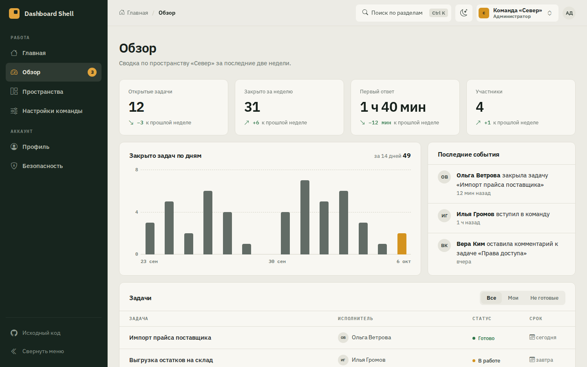
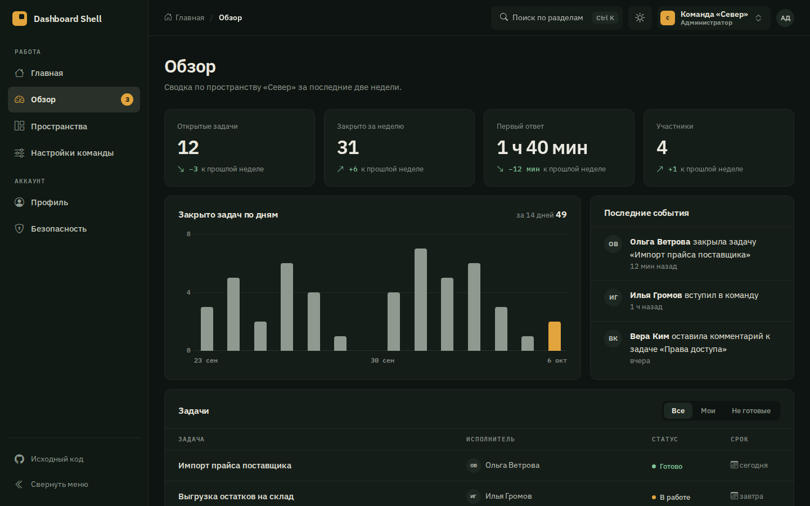
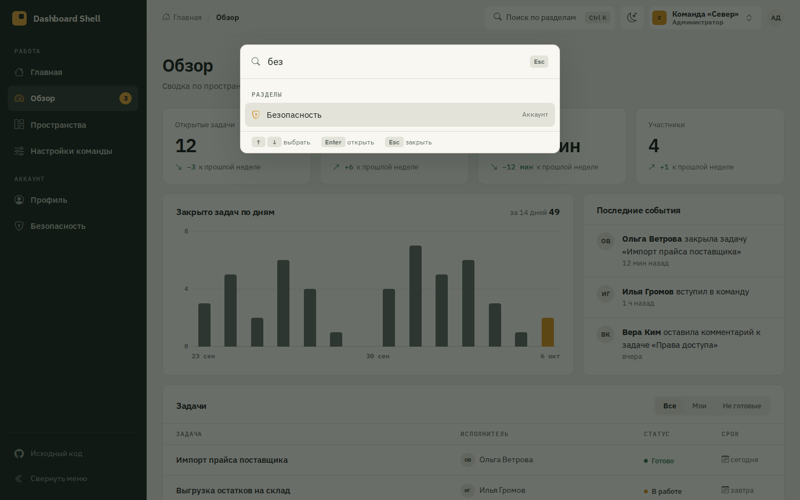
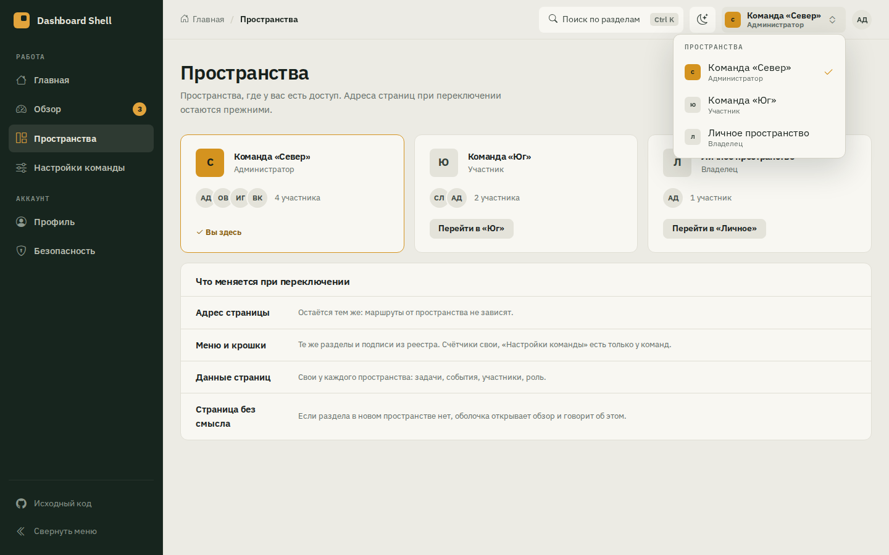
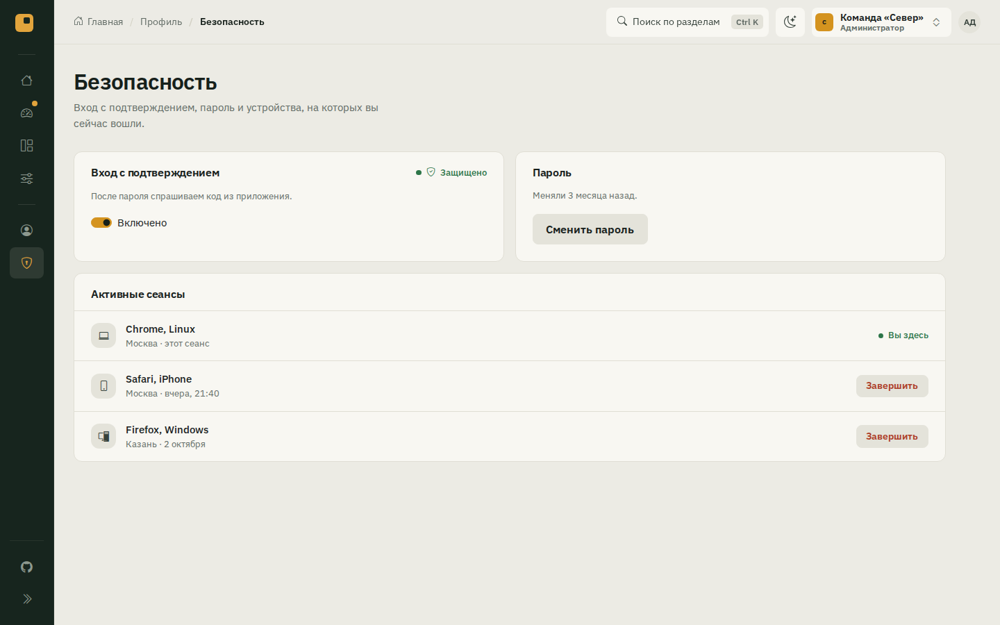
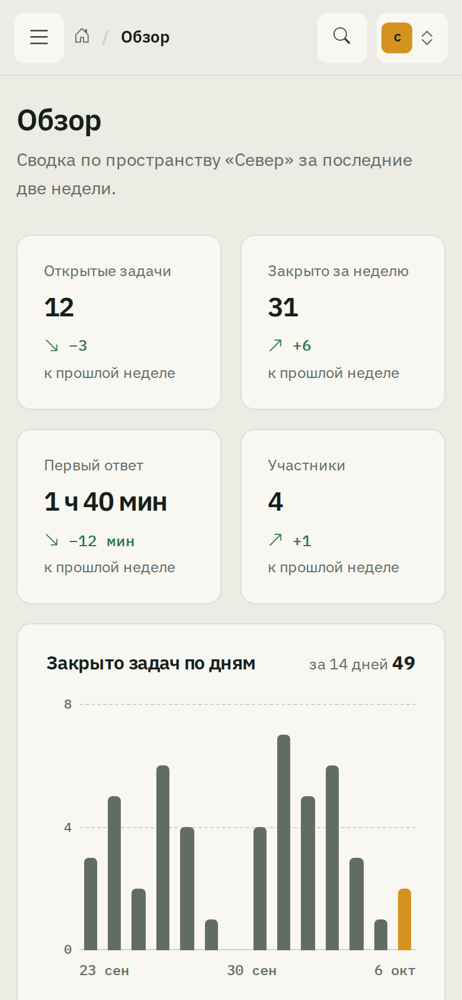
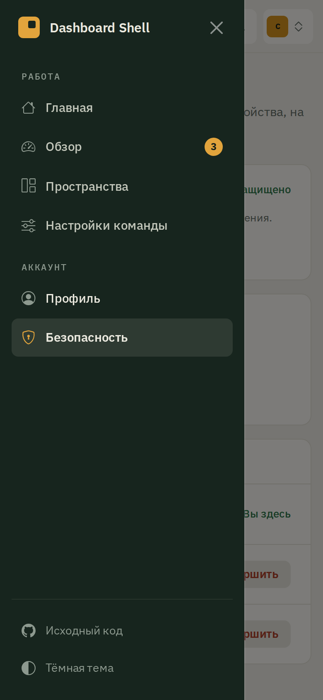

# Dashboard Shell на Bootstrap 5

[](https://github.com/AutoPasha/bootstrap-dashboard-shell/actions/workflows/tests.yml)


**Живая страница: https://autopasha.github.io/bootstrap-dashboard-shell/**

Оболочка кабинета без сборки: ES-модули и Bootstrap 5.3.8 из `vendor/`. Меню, Offcanvas, крошки, заголовки и поиск по разделам строятся из одного реестра маршрутов. Рабочий контекст хранится в одном сторе оболочки, роль приходит вместе с ним как данные, поэтому оболочка одна на все роли.



<table>
  <tr>
    <td width="50%"></td>
    <td width="50%"></td>
  </tr>
  <tr>
    <td>Тёмная тема, выбор помнится между заходами</td>
    <td>Поиск по разделам на <kbd>Ctrl</kbd> <kbd>K</kbd>: разделы, пространства, действия</td>
  </tr>
  <tr>
    <td></td>
    <td></td>
  </tr>
  <tr>
    <td>Переключатель пространства: адрес тот же, данные свои</td>
    <td>Свёрнутое меню на ноутбуке, подписи остаются для читалки</td>
  </tr>
</table>

<p>
  
  &nbsp;
  
</p>

На телефоне то же меню открывается в Offcanvas: та же разметка, что и колонка на ноутбуке.

## Как реестр становится меню, Offcanvas и крошками

```js
// src/routes.js
{ path: '/app/account/security', title: 'Безопасность', parent: '/app/account', section: 'account', icon: 'shield-lock' },
```

- `src/routes.js`: реестр. У каждой строки `path`, `title`, `parent`, `section`, `icon` и по желанию `only`, в каких видах пространства страница имеет смысл.
- `buildNav(registry, context)` в `src/nav.js` собирает модель меню: разделы и пункты в порядке реестра, счётчики из контекста, страницы без смысла в нём пропускаются. Функция чистая, без DOM, её проверяют юнит-тесты.
- `renderNav` в `src/shell.js` рисует модель в одну разметку с классом `.offcanvas-lg`. От 992px это колонка sidebar, на экранах уже это Offcanvas. Второго меню в DOM нет, поэтому пунктам негде разъехаться.
- `breadcrumbs(registry, path)` идёт по цепочке `parent`: Главная / Профиль / Безопасность. Последняя крошка без ссылки и с `aria-current="page"`.
- Поиск по разделам берёт пункты из той же `buildNav`, плитки «Разделы» на главной тоже.
- Новая страница = строка в реестре и функция в `src/pages.js`. Меню, крошки, поиск, `document.title` и тесты подхватят её сами.

## Где контекст

- `src/store.js`: стор оболочки хранит `contextId` (в sessionStorage, чтобы пережить перезагрузку). Меню и страницы читают его и подписываются на изменения.
- Адреса от контекста не меняются. Меняются подписи, роль, счётчики в меню и данные страниц.
- Если открытая страница теряет смысл в новом контексте (настройки команды в личном пространстве), оболочка уводит на `/app/overview`, заменяя запись в истории, и сообщает об этом через `aria-live`.

## Клавиатура и фокус

| Что | Как |
|---|---|
| Skip-link | первый <kbd>Tab</kbd>, ставит фокус на h1, hash-маршрут не трогает |
| Активный пункт | `aria-current="page"` в меню и на последней крошке |
| Переход | фокус на h1 новой страницы, при первой загрузке фокус на месте |
| Offcanvas | открывается с фокусом на текущем пункте, <kbd>Esc</kbd> закрывает и возвращает фокус на кнопку меню, переход по пункту закрывает меню и ставит фокус на h1 |
| Поиск | <kbd>Ctrl</kbd> <kbd>K</kbd> или <kbd>/</kbd>, стрелки выбирают, <kbd>Enter</kbd> открывает, <kbd>Esc</kbd> возвращает фокус туда, откуда открыли |
| Пространство | кнопка в шапке, стрелки по списку, <kbd>Enter</kbd> |

## Тесты

- `npm run test:unit`: реестр, `buildNav` и `breadcrumbs` в node, без браузера.
- `npx playwright test tests/matrix.spec.js`: матрица 6 маршрутов × chromium, firefox, webkit × 6 ширин (320, 375, 768, 991, 992, 1440), всего 108 прогонов. В каждом проверяются h1 и title, единственный пункт с `aria-current`, крошки, отсутствие прокрутки вбок, skip-link, меню с клавиатуры и фокус на h1 после перехода на соседнюю страницу. Ширины 991 и 992 стоят по обе стороны границы, где Offcanvas становится sidebar.
- Сценарии оболочки по каждому браузеру на телефоне и ноутбуке: смена контекста, уход со страницы без смысла, поиск, тема, свёрнутое меню, фильтр задач, завершение сеанса.
- В итогах каждого прогона Actions лежит таблица матрицы маршрут × браузер × ширина. GitHub Pages выкатывается только после зелёной матрицы.

## Запуск

```bash
npm ci
npm start                     # http://127.0.0.1:4173/
npx playwright install chromium firefox webkit
npm test
```

```
index.html          оболочка: sidebar/Offcanvas, topbar, main, поиск
src/routes.js       реестр маршрутов
src/nav.js          buildNav и breadcrumbs, без DOM
src/store.js        стор контекста
src/shell.js        роутер, отрисовка, фокус, поиск, тема
src/pages.js        содержимое страниц
src/data.js         demo-данные пространств
src/shell.css       тема поверх Bootstrap
tests/              юнит-тесты, матрица, сценарии, сводка для Actions
```

## Почему маршрут в hash

GitHub Pages отдаёт статику и не умеет переписывать адреса, поэтому маршрут живёт в `#/app/...`. В приложении с сервером реестр, `nav.js` и тесты остаются как есть, меняются две функции в `shell.js`: `pathFromHash` и `go`.

Шрифты IBM Plex (OFL), Bootstrap и Bootstrap Icons (MIT) лежат в `vendor/` со своими лицензиями. Код demo под MIT.
